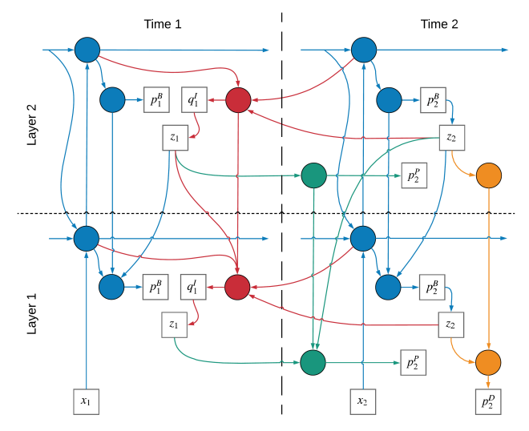

# Temporal Difference Variational Auto-Encoder (TD-VAE)
The code implements the framework proposed in Temporal Difference Variational Auto-Encoder (Gregor et al).
The main purpose is to make it a simple block that is easy to use as a plugin of the network.
As the sampling process in the multi-stochastic-layer version is extremely complicated, I try the trick of recursive function call to simplify it.
 

# Result: The moving digist experiment
 
The task of moving digist is mainly to predict the next digist state after observing a sequence of moving digists. Dataset used in this experiment is as defined in "moving_mnist.py". Notice for the row 6 of "moving_mnist.py", before you use it, please make sure to either change the root path of mnist dataset according to your situation or to change the "download" flag into True. The results are as shown in below.
 

 
<strong> Ground truth </strong>

 
<strong> Single state predition</strong>

 
<strong> Roll out (Recursive prediction)</strong>

 

