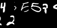
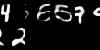
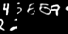

# Temporal Difference Variational Auto-Encoder (TD-VAE)

The code implements the framework proposed in Temporal Difference Variational Auto-Encoder (Gregor et al).
The main purpose is to make it a simple block that is easy to use as a plugin of the network.
As the sampling process in the multi-stochastic-layer version is extremely complicated, I try the trick of recursive function call to simplify it.
 

 

 

 

